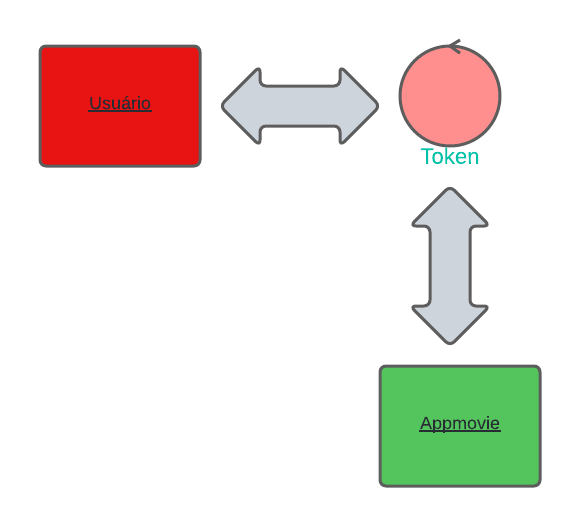

## API Appmovie
Uma Api RESTFULL para organização de videos, faça o upload de seus arquivos e os classifique com tags que você mesmo pode criar. Esta API Foi contruida com [Laravel 8](https://laravel.com/docs/8.x) utilizando [PHP 7.4](https://www.php.net/releases/7_4_0.php) o limite de arquivo enviado é de 5mb. Faça um teste!

## Como Funciona?
API é muito simples! Ela conta com três grupos de rotas principais e uma para autenticação para o acesso. Ou seja, exitem três parâmetros que facilitam o consumo do serviço. O primeiro é grupo de usuário, responsável pela conta e manutenção do perfil, o segundo é o grupo responsável pela criação e edição de videos e, por fim, o terceiro grupo que é responsável pela criação de tags.

## Autentificação
A autenticação de usuários funciona via [token](https://pt.wikipedia.org/wiki/Token_(chave_eletr%C3%B4nica)) no formato [json](https://www.json.org/json-en.htmljwt-). Para esta aplicação foi utilizado o [jwt-auth](https://jwt-auth.readthedocs.io/en/develop/). O acesso ao serviço funciona da seguinte forma, o usuário ao entrar pela  área de login receberá uma chave (neste caso o token) que validará seu acesso em todos os serviços da aplicação, se por acaso um usuário externo, não logado, tentar entrar sem essa chave ele será barrado e receberá um erro de acesso não autorizado.



## Organize seus videos com tags
Com o seu arquivo já no sevidor você poderá edita-lo, exclui-lo, adiconar tags e remover tags. Você tambem poderá organiza-los de forma ascendente ou descendente de acordo com o nome do arquivo.

## Como Usar?
Neste tópico será documentado como utilizar as rotas da API. Vamos lá!
### Autenticação de usuários
A rota de autenticação conta com um grupo de de parametros expecífico para cada atribuição.

* [URL](http://localhost:8180)/auth/login   
* [URL](http://localhost:8180)/auth/logout   

Essas rotas destinam-se a usuários que já possuem uma conta na aplicação. Então, será preciso fazer o login para receber o token de permissão. A rota logout será responsável por remover o token e sair do serviço. Para cadastro de usuário temos a rota:

* [URL](http://localhost:8180/api)/auth/register 

Para cadastro, o usuário utilizará os dados como nome, email e uma senha. Se por acaso o usuário enviar um formulário nulo ele receberá um erro de cadastro. Ainda há duas rotas que auxíaliaram no acesso:

* [URL](http://localhost:8180/api)/auth/refresh 
* [URL](http://localhost:8180/api)/auth/me 

O refresh será responsável pela renovação do token, para nossa aplicação o periodo normal para renovação é de uma hora. A rota "me" será responsável pelo reconhecimento do usuário autenticado na aplicação.

### Cadastro e upload de videos curtos
A rota para edição de videos segue o esquema [CRUD](https://developer.mozilla.org/pt-BR/docs/Glossary/CRUD) convencional.

* [URL](http://localhost:8180/api)/movies/create
* [URL](http://localhost:8180/api)/movies/delete/[ID]()

A Rota create receberá o nome e o arquivo do video. e retornará uma mensagem com os dados do arquivo, como por exemplo, nome, armazenamento, tipo do arquivo e tamanho do arquivo. A rota delete recebe um parâmetro que será o id do video que o usuário quer apagar. Para exibição dos videos a API conta com quatro rotas.

* [URL](http://localhost:8180/api)/movies/index
* [URL](http://localhost:8180/api)/movies/index/orderby/asc
* [URL](http://localhost:8180/api)/movies/index/orderby/desc

As três primeiras são responsaveis por exibir todos os filmes listados no banco de dados. A rota com final 'asc' exibirá os filmes em ordem ascendente de acordo com o nome e a rota 'desc' os exibirá em ordem descendente de acordo com o nome.

* [URL](http://localhost:8180)/movies/show/[ID]()

A quarta rota de exibição, destina-se a exibir o usuário pelo seu id. Ou seja, quado requisitada com o id de um usuário retornará um [json](https://www.json.org/json-en.htmljwt-) com informações desse arquivo. A última tag é a de atualização das informações.

* [URL](http://localhost:8180)/movies/update/[ID]()

A rota recebe como parâmetro o id do video que o usuário pretende atualizar e envia as informações atualizadas para esse id no banco de dados. 
### Adicione Tags para seus videos
A rota para as tags conta com apenas duas rotas, uma para criação e outra para excluir. Vale uma ressalva, que a relação entre tags e filmes é de [many to may](https://en.wikipedia.org/wiki/Many-to-many_(data_model)) (muitos para muitos). Neste caso, a criação de uma tag está atrelada a um filme, mas não necessariamente a ele e vice e versa. Então, quando um filme é excluido as tags desse filme permanecerão no banco de dados e serão desvinculadas. Para exclusão definitiva de uma tag utilize a rota:

* [URL](http://localhost:8180)/tags/delete/[ID]()

Neste caso será repassado o id da tag e não do filme. para criar uma tag nova, utilize a rota:

* [URL](http://localhost:8180)/tags/create/[ID]();

neste caso o id é o do filme ao qual a tag foi adicionada. As tags são criadas para um filme podendo ser reaproveitadas em outros videos.

## Rodando A API
Agora vamos colocar a api para funcionar localmente! Primeiramente, clone o repositório para sua máquina local. Será necessário ter o docker e docker-compose instalado em seu computador.

       //link para clone

Suba os containers do projeto
```sh
docker-compose up -d
```


Acessar o container
```sh
docker-compose exec laravel_8 bash
```


Instalar as dependências do projeto
```sh
composer install
```


Gerar a key do projeto Laravel
```sh
php artisan key:generate
```


Perfeito! Rode o comando abaixo e pronto! Aplicação no ar!
  
     php artisan serve

Acesse o projeto
[http://localhost:8180/api/](http://localhost:8180/api/)
 

<!-- ## Rode a Api junto com uma interface gráfica -->


